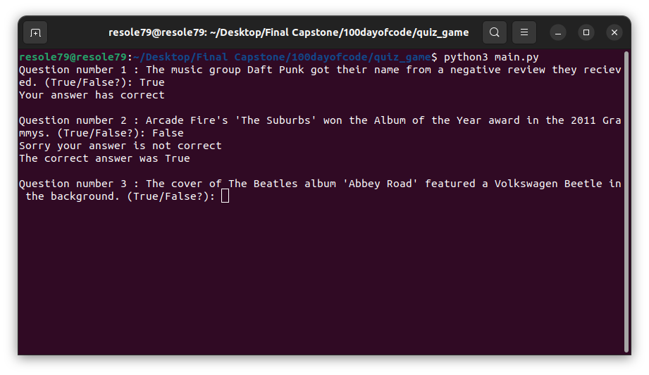

## Quiz Game    

Program for **Quiz Game**    

OOP version of the "Simple Quiz Game"    
List of random questions and the user must insert True/False answer.    

The question are from [Open Trivia Database](https://opentdb.com/)     

###### It's a part of the **#100DaysOfCode** challenge by Angela Yu. ######


#### Installation
To get started with the Quiz Game, follow these steps:

1. **Clone** the repository:

```sh
git clone https://github.com/resole79/quiz_game.git
```

2. **Run** the **main.py** file:

```sh
python3 main.py
```     

#### *File Structure*
 - **main.py**: Main program.
 - **question_model.py** : Class "Question"
 - **quiz_brain.py** : Class "QuizBrain" 
	 - *Instance*:
		- question_list,
		- question_number,
		- score
	- *Method*:
		- "still_has_question"( check if are still question left ), 
		- "check_answer"( check if the answer are correct ),
		- "nex_question" ( show next question )
 - **data.py** : File contains the questions

#### **Usage**


**How program present**

Ask the user to input:
 - Answer True / False about a question

<p align="center"><br><i></i></p>

## **Credit**

Author : Emilio Reforgiato (resole79)

##
<p align="right"><a href="https://www.linkedin.com/in/emilio-reforgiato/" target=”_blank” ></a></p>


